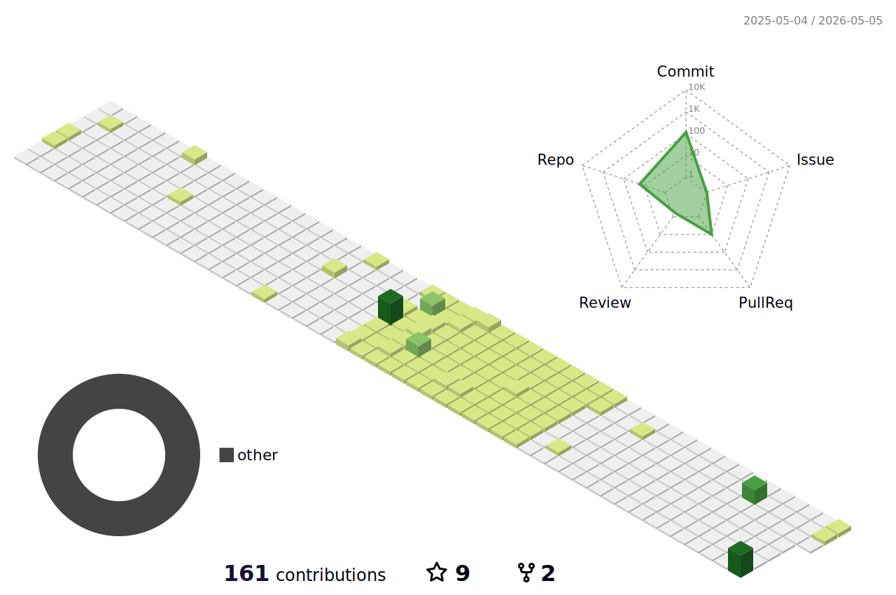

<h3 align="center">
  <a href="https://git.io/typing-svg">
    <!--      -->
    
  </a>
  </h1>

<h1 align="center">🙋 Hi 👋, I'm Steven</h1>
<h3 align="center">💻 A passionate code farmer from China</h3>

  
  &emsp;
  

---

### 🐍 Contribution Snake

  <picture>
    <source media="(prefers-color-scheme: dark)" srcset="https://github.com/stevenatom/stevenatom/blob/output/github-snake-dark.svg" />
    <source media="(prefers-color-scheme: light)" srcset="https://github.com/stevenatom/stevenatom/blob/output/github-snake.svg" />
    
  </picture>

---

### 📊 Metrics & Activity

  
  

  

---

### 🏆 Achievements

  

---

### 💡 About Me

- 🔭 Currently working on **[SOC](https://github.com/stevenatom)**
- 📝 I write tech articles on [https://chenlong.co](https://chenlong.co)
- 📫 Reach me at **xxxx@qq.com**

---

### 🧰 Languages & Tools

  
  
  
  
  
  
  
  
  
  
  
  
  
  
  

---

### 📈 GitHub Stats

  
  

---

  

